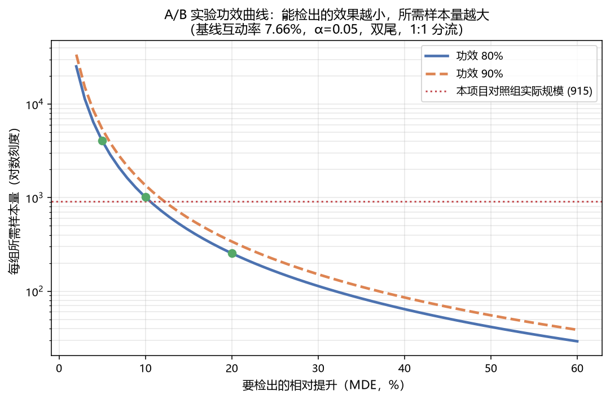
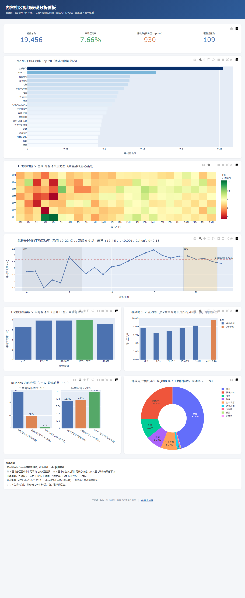

# 内容社区视频表现分析

这个项目想回答一个问题：在内容社区里，什么样的内容、在什么时间发布、做成什么形式，更容易获得用户互动。

为此我从 B站公开接口采了 28,000 条视频数据，清洗掉广告和异常值之后留下 19,456 条，覆盖 109 个内容分区、11,841 个 UP 主。除了视频本身的数据，我还额外采了 271 万条弹幕，用来看看观众到底在说什么。

围绕这批数据做的事情大致是：采集，清洗入库 MySQL，写 12 条 SQL 做分析，跑统计检验和建模，用大模型把整条取数与解读流程自动化，最后做了一个交互式看板。下面按我实际做的顺序说，中间踩的坑比结论更有意思。

---

## 采集时踩的两个坑

### 第一个坑：接口不报错，但数据是假的

B站的搜索接口要求请求带上鉴权参数。我一开始不知道，直接请求，接口返回 `code=0`，看起来完全成功，也拿到了 20 条数据。

问题是，每个关键词跑完 50 页，翻出来的结果全是同一页。当时我还以为是这个关键词下内容本来就少。后来把每页的 bvid 抽出来做去重统计才发现，**50 页的重叠率是 100%**。

这是整个项目里最难查的 bug，因为它不报错。我逐页对比去重率，最后定位到是请求缺少必要的鉴权参数。补上之后，单个关键词 50 页能拿到约 700 条唯一数据。

这件事让我养成了一个习惯：**接口返回"成功"不等于拿到了想要的数据，必须验证数据本身**。

这个习惯后来救了我第二次。采弹幕的时候，98.8% 的视频返回空弹幕。一开始真以为是这些视频没人发弹幕，查了才发现是我用的那个域名被限流了，返回的是 3,400 字节的 HTML 错误页，而不是 XML。换成另一个域名之后，命中率回到 100%。

### 第二个坑：采回来的数据里混着广告

搜索结果里会插播课程广告，伪装得很像正常视频。但它有几个特征：`bvid` 是空的、`pubdate` 是 0、点赞数恒为 0。

这类记录有 656 条，占 2.3%。如果不识别出来，会污染播放量分布，还会让我多采集 300 多个无效账号的粉丝数据。

---

## 清洗时发现的一个数据陷阱

B站对"多P合集"返回的时长是**所有分P的累计时长**，不是单集时长。

我一开始没注意，直到看时长分布才发现不对：中位数才 9.8 分钟，但 P90 是 960 分钟，P99 到了 6,295 分钟。最长的几条"视频"有 800 多小时，那明显是几百集的课程合集。

这类样本占 21.7%。如果不单独处理，直接拿时长做回归，这 4,000 多条会把结果彻底带偏。我的处理方式是打个 `is_collection` 标记，分析时分开讨论。

顺带还有一个细节：有些合集的时长会随着创作者后续更新继续增长。也就是说这个字段里隐含了发布之后的信息，做预测模型时要留意。

清洗一共写了 11 条规则，包括按 bvid 去重、剔除播放量低于 100 的样本、对互动率做 1%/99% 分位截尾等等。

---

## 建模时发现自己差点"作弊"

爆款预测模型第一版跑出来 AUC 0.67，看着还行。但我做完特征审查之后，把模型推翻重做了。

问题出在粉丝数这个特征上。

我采到的粉丝数是**采集那一刻**的值，不是**视频发布时**的值。对 2017 年发布的视频来说，"现在粉丝多"很大一部分原因是"过去爆过"——用这个特征去预测那条视频是不是爆款，等于用结果预测结果。

为了量化这件事，我做了一次消融实验，逐层加入可疑特征看 AUC 怎么变：

| 特征集 | 特征数 | AUC | PR-AUC |
|---|---|---|---|
| 只用发布前确定、且发布后不随时间变的特征 | 20 | 0.6052 | 0.0878 |
| 加上时长和合集标记 | 22 | 0.6460 | 0.1122 |
| 再加上粉丝数 | 23 | 0.6720 | 0.1336 |

粉丝数和时长合计贡献了 0.067 的 AUC。全部剔除之后，模型 AUC 只剩 0.61。

所以我最后的结论不是"我能预测爆款"，而是：**仅凭发布前特征很难预测爆款**。这个结论本身比一个虚高的 AUC 有价值——它说明内容能不能爆，很大程度上取决于平台推荐和传播的随机性，不是创作者单方面能决定的。

另外提一句逻辑回归。它的 AUC 只有 0.53，几乎等于随机猜测。我没把它当 bug 去调参，因为目标变量已经按分区分组归一化过了，剩下的特征和爆款之间是非线性关系，线性模型本来就拟合不了。随机森林能到 0.65，两者 0.12 的差距，本身就是"关系非线性"的证据。

---

## 做意图分析时，顺手把标注质量也查了一遍

我用 DeepSeek API 给 6,000 条弹幕做了 9 类意图标注，然后自己人工抽检了 200 条，准确率 93.0%。

比准确率更值得说的是错误的分布。我把这 200 条逐条看过，发现模型出错不是随机的，而是集中在几类系统性歧义上：

一是**需要视频上下文才能判断的弹幕**，比如复述视频台词、引用标题玩梗。这类占 3-5%，脱离视频内容根本判断不了意图。这是数据集的固有限制，改提示词也解决不了。

二是**"求推荐"和"给出推荐"混淆**。模型看到"推荐"两个字就归类，忽略了说话人是在索要还是给予。

三是**"提问"和"求教程"的优先级没定**。"新课的课件哪里可以获取"形式上是疑问句，实质是求资源。

这些多数不是模型能力问题，而是任务定义本身有歧义。完整记录在 `docs/标注质量分析.md` 里，包括我写的 19 条逐条备注。

---

## 数据里发现的几件事

### 发布时间确实影响互动，但没有想象中那么大

晚间 19 到 22 点发布的视频，平均互动率 0.0776；凌晨 0 到 6 点发布的，0.0667。差 16.4%。

我做了完整的假设检验。Shapiro-Wilk 显示两组都不是正态分布，Levene 检验显示方差不齐，所以用 Welch t 检验而不是普通 t 检验，p 值是 2.4e-08。Mann-Whitney U 作为非参数交叉验证，结论一致。Bootstrap 2000 次得到的 95% 置信区间是 [+0.0070, +0.0149]，不含 0。

但有个数字必须说清楚：**Cohen's d 只有 0.18**，属于小效应。

1.9 万样本下，p 值必然是显著的，它只能回答"差异存不存在"。真正该看的是效应量，它回答"差异有多大"。0.18 意味着这个差异是真的，但不是决定性的。

还有一点，下午 14 到 17 点的互动率其实是 0.0802，比晚间还略高。所以准确的说法是"下午和晚间是互动率最高的两个时段"，而不是"晚间就是黄金时段"。

### 那这 16.4% 是"时间"造成的，还是"内容"造成的

上面那个 16.4% 是**相关**，不是**因果**。

晚间发布的视频，可能本身就来自更用心的创作者、更大的账号、更长或更短的内容。互动率高也许源于这些差异，而不是发布时间。这就是**选择偏差**。

我的数据是历史数据，发布时间由创作者自己决定，做不了真正的随机 A/B 实验。所以我用了两种准实验方法去逼近因果。

**倾向得分匹配（PSM）**：先用一个 Logistic 回归预测"这条视频会不会在晚间发布"，再给每条晚间视频匹配一条倾向得分接近的凌晨视频。匹配后"时长"和"合集标记"都平衡了（SMD < 0.1），但"粉丝数"还剩 0.22 的残余差异。原因是**对照组只有 915 条，要匹配 5,142 条**，对照池很快就不够用了。

**逆概率加权（IPTW）**：不丢样本，按倾向得分的倒数给全部样本加权。这个方法的协变量平衡性更好，时长、粉丝数、合集标记三项都达到 SMD < 0.1。

| 估计方法 | 晚间相对凌晨的差异 |
|---|---|
| 原始（未控制混淆） | **+16.38%** |
| PSM 匹配后 | +13.59% |
| **IPTW 加权后** | **+8.25%** |

**结论**：控制住时长、粉丝量级、分区、年份这些差异之后，时段效应从 16.4% 收窄到 8.3%。**原来那 16.4% 里大约一半来自选择偏差**——不是"晚上发就会更好"，而是"晚上发的视频本来就不一样"。

这不是说时段没用。8.3% 的效应仍然存在，只是它比表面看起来小得多。**如果按 16.4% 去做业务决策，会高估收益接近一倍。**

代码见 `src/10_psm_causal.py`，结果见 `results/m12_PSM因果分析.csv`。需要说明的是，这仍然是准实验——数据集无法做真正的随机分组，因果强度低于随机对照实验。

### 反过来的问题：如果真要做实验，需要多少样本

PSM 和 IPTW 都是在"没有实验"的前提下做的补救。那如果真的能做 A/B 实验呢？

有一个问题必须在实验开始前回答：**要检出多大的效果，需要多少样本？** 它不需要实验数据，用基线就能算。

我用全样本估了基线：互动率均值 **7.66%**，标准差 0.0615。**变异系数 0.8**——互动率的个体差异很大，这直接决定了实验成本会很高。

设定双尾检验、α=0.05、两组等量分流：

| 要检出的相对提升 | 绝对提升 | 每组所需样本 |
|---|---|---|
| +3% | +0.23pp | 11,257 |
| +5% | +0.38pp | 4,053 |
| **+10%** | +0.77pp | **1,014** |
| +20% | +1.53pp | 255 |
| +50% | +3.83pp | 42 |



反过来算也有意思：**我项目里凌晨组只有 915 条样本。按这个规模做实验，只能稳定检出 +10.5% 以上的效应**，比这更小的改动根本验不出来。

这条结论有实际的业务含义：**提出"小改动带来小提升"的方案之前，先算样本量。** 流量不够时，要么延长实验周期，要么承认这个改动在统计上无法验证。很多"实验没做出显著效果"的结论，其实是样本量根本不够。

代码见 `src/11_power_analysis.py`。

### 108 个分区之间，互动率差异是真实的吗

前面做的都是两组比较（晚间 vs 凌晨）。但数据里有 108 个分区，真正该问的是：**分区之间的互动率差异是真实的，还是随机波动？**

这里不能直接两两做 t 检验。108 个分区两两比较需要 C(108,2)=5,778 次检验，每次 5% 的假阳性率——即使分区之间毫无差异，也会期望出现约 289 次"显著"结果。**这就是多重比较问题。**

所以我用单因素方差分析，它一次性检验所有组，把族错误率控制在 5%。

先检查假设：Levene 检验 p = 1.5e-77，**方差不齐**，ANOVA 的方差齐性假设不成立。于是我同时跑了三种方法交叉验证：

| 方法 | 统计量 | p 值 |
|---|---|---|
| 经典 ANOVA | F(20, 17462) = 64.29 | 1.1e-250 |
| Welch ANOVA（不要求方差齐性） | F(20.0, 2596.0) = 84.46 | 2.0e-264 |
| Kruskal-Wallis（非参数） | H = 1610.0 | ≈ 0 |

**三种方法结论一致：分区确实影响互动率。**

但效应量 η² 只有 **0.0686**——分区只能解释互动率变异的 **6.9%**，剩下 93.1% 来自分区内部。按 Cohen 标准（0.01 小 / 0.06 中 / 0.14 大）属于中等效应。

后续用 Tukey HSD 做事后两两比较，对全部 210 对比较做了多重比较校正，其中 130 对显著。差异最大的是"亲子""美食侦探"这类分区对比"计算机技术"：

| 分区 A | 分区 B | 均值差 |
|---|---|---|
| 亲子 | 计算机技术 | 0.0641 |
| 美食侦探 | 计算机技术 | 0.0562 |
| 单机游戏 | 计算机技术 | 0.0537 |

这个结果有一个实际用处：**它从统计上解释了项目为什么把"爆款"定义为「同分区 Top 5%」。** 分区效应虽然显著，但只能解释 6.9% 的变异——**跨分区直接比互动率是不公平的**（计算机技术区均值 0.1044，是亲子区的 2.6 倍），必须先分层再比较。

代码见 `src/12_anova.py`。

### 粉丝量级和互动率是倒 U 型

10 万到 100 万粉的账号互动率最高，0.0801。往下，1 千粉以下只有 0.0655；往上，百万粉以上回落到 0.0723。

这不是"粉丝越多互动越差"那么简单。小账号的问题是曝光不足，大账号的问题是泛粉太多，中腰部反而是互动效率最高的一档。

### 内容可以分成三种互动形态

我用 KMeans 给内容分群，最后得到 3 类，轮廓系数 0.58。

占比最大的是**社区讨论型**（72.5%），弹幕占比 0.906，靠弹幕互动，社区氛围强。其次是**收藏沉淀型**（25.1%），收藏占比 0.563，弹幕占比只有 0.034，是典型的干货和教程内容。最少的是**投币认可型**（2.5%），投币占比 0.302，是其他两类的 50 倍，用户愿意付费支持。

这里有个方法上的取舍值得记一下。我最初是用"绝对比率"（点赞率、收藏率这些）做聚类特征的，轮廓系数高达 0.85，但只分出 2 类，而且本质是"异常值 vs 正常值"，没有业务含义——因为比率分布右偏太严重，几个极端值主导了聚类结果。

后来改成用"互动结构占比"（各互动行为占总互动的比例），轮廓系数降到 0.58，但三类含义清晰，能直接对应到内容策略。

### 弹幕里近一半是没有意图的

6,000 条标注里，"其他"（无指向内容）占 45.4%。真正含信息需求的比例并不高。

分区之间的差异倒是很有意思。健身区有 57.8% 的弹幕是"打卡许愿"——这是典型的陪伴式内容，用户靠仪式感坚持，运营重心应该是陪伴和进度激励，而不是知识科普。美食侦探和数码区的"消费决策"意图最高，分别是 5.34% 和 4.21%，是校园学习区的 20 倍，这两个品类天然带种草属性。

---

## 看板



看板是单个 HTML 文件，用 Plotly 做的，包含 8 个模块：KPI 总览、分区互动率、发布时段热力图、小时趋势、粉丝量级、视频时长、内容分群、意图分布。图表支持悬浮查看明细、框选缩放、点击图例筛选。

在线版本：https://arnoldwang-86.github.io/content-community-analysis/dashboard/index.html

---

## 用大模型把分析流程自动化

前面所有分析都是我手写的。做的过程中我意识到一个问题：**同一套取数逻辑，换个业务方问法就要重写一遍。**

所以我做了一个 Text-to-SQL 数据 Agent——输入一句自然语言，输出 SQL、数据和业务解读。

### 它不是「调一次 API 生成 SQL」

把问题丢给模型让它生成 SQL，执行，输出——大部分 Demo 到这里就结束了。但真实场景里第一次写错是常态，所以我把中间拆成了七步：

#B3#
问题
 ├─ ① 语义层        手写字段的业务含义、计算口径与已知陷阱
 ├─ ② SQL 生成      DeepSeek API，输出结构化 JSON（sql + intent + 用到的表）
 ├─ ③ 安全闸门      白名单校验，只放行单条 SELECT，拦截一切写操作
 ├─ ④ 执行          MySQL，行数截断后再回传
 ├─ ⑤ 错误自愈      把「问题 + 错误SQL + MySQL报错」回喂 → 重写 → 重试（≤3 次）
 ├─ ⑥ 结果解读      把查询结果翻译成业务结论
 └─ ⑦ 自动出图      按结果结构判断用折线、柱状还是饼图
#B3#

### 第一版跑出来的结论是错的

这是这个项目里最有价值的一次失败。

第一次问「哪个内容分区的平均互动率最高」，模型给出的 SQL 语法完全正确：

#B3#sql
SELECT c.tname, AVG(v.interact_rate) AS rate
FROM video v JOIN category c ON v.tid = c.tid
GROUP BY c.tname ORDER BY rate DESC LIMIT 5
#B3#

跑出来的答案是「音乐教学 25.42%」。

**但这个分区只有 3 条视频。**

SQL 本身没有错，错的是业务口径——模型不知道聚合时要过滤小样本。我在语义层里补上统计可靠性规则后，它自动生成了带过滤条件的 SQL：

#B3#sql
... HAVING COUNT(*) >= 30 ...
#B3#

结论也变成了有意义的结果：仿妆cos 11.62%（91 条样本）、计算机技术 10.44%（2,190 条样本，最扎实）。

**这件事让我确认了一点：Text-to-SQL 的瓶颈不在 SQL 生成，而在你喂给它多少业务口径。**

### 语义层：把数据库的「潜规则」显式写出来

我们数据库的字段没有 COMMENT，模型不可能猜到 `duration_s` 对多P合集返回的是所有分P的累计时长。所以我把字段的业务含义、计算口径和已知陷阱单独维护成一份语义层，和数据库本身解耦：

| 字段 | 语义层里写了什么 |
|---|---|
| `interact_rate` | 已定义为（点赞+投币+收藏）/播放量，并做过 1%/99% 截尾，**分析时直接用它，不要重算** |
| `duration_s` | ⚠️ 多P合集返回的是**累计时长**（最长 817 小时），涉及时长的分析必须说明 |
| `follower` | ⚠️ 是**采集时的当前值**，不是发布时的值，做预测会构成时间穿越 |
| 聚合口径 | 样本量 < 30 的分区统计不可靠，**取平均值 Top-N 必须加 HAVING COUNT(*) >= 30** |

### 错误自愈：注入 3 种故障，3 种全部修复

模型在简单问题上一次就写对，自愈逻辑根本不会被触发。所以我写了故障注入器，主动制造失败来验证容错路径真的有效：

| 注入的故障 | MySQL 报错 | 结果 |
|---|---|---|
| 字段名幻觉：`interact_rate` → `interaction_rate` | (1054) Unknown column | 自动改回 |
| 表名幻觉：`category` → `categorys` | (1146) Table doesn't exist | 自动改回 |
| 语法错误：`GROUP BY` → `GROP BY` | (1064) SQL syntax error | 自动改回 |

模型修完还会解释原因：

> "报错原因：video 表中不存在 interaction_rate 列，实际字段名为 interact_rate（口径为 (点赞+投币+收藏)/播放量，已截尾）。修正：将 AVG(v.interaction_rate) 改为 AVG(v.interact_rate)。"

**故障注入本来就是工程上验证容错逻辑的标准做法。** 一个只会生成一次的系统，在模型幻觉面前毫无还手之力；而一个能「执行 → 观察 → 修正」的系统，就有了自我纠错能力。

### 顺手把 Prompt 抽成了库

做完 Agent 后我发现，项目里已经有 4 个 Prompt 分散硬编码在各个脚本中——换项目要复制粘贴、改了不知道改哪份、没法单独测试。于是我抽成了 `src/prompts.py`：

每个 Prompt 拆成**角色、上下文、任务、约束、输出格式**几个独立字段，而不是揉成一大段字符串。约束用清单而不用自然段，因为清单才能逐条增删和做回归验证。

更重要的是，**每个 Prompt 都跟着一段设计说明，记录为什么这么写**。比如 `sql_repair` 里有一条约束是「只修改报错的部分」——这是实测加上的，不加的话模型会重写整条 SQL，有时把原本正确的业务口径（比如 `HAVING COUNT(*) >= 30`）一并改掉。**修复行为本身也需要被约束。**

意图分类的 Prompt 还带着完整的版本迭代记录：v1.0 时「提问」类有约 40% 误判（模型把「时间复杂度」这种纯术语也当成提问），v2.0 加了可判定的条件和显式反例后，人工抽检正确率从约 60% 升到 90%。

命令行可以查看任意一个 Prompt 的完整定义和设计说明：

#B3#bash
python src/prompts.py --list
python src/prompts.py --show sql_repair
#B3#

---

## 项目结构

```
项目-内容社区分析/
├── src/ 11 个 Python 脚本
│ ├── bili.py 接口客户端（鉴权参数、重试退避、限流）
│ ├── 00_data_audit.py 数据质量审计
│ ├── 01_collect_search.py 搜索采集（28 个关键词 × 50 页）
│ ├── 02_collect_ups.py UP 主粉丝数
│ ├── 03_collect_detail.py 视频详情（投币/分享/cid）
│ ├── 04_collect_danmaku.py 弹幕文本采集
│ ├── 05_clean_to_db.py 清洗入库（11 条清洗规则）
│ ├── 06_export_results.py 批量导出分析结果
│ ├── 07_stats_model.py 统计检验 + 建模 + 消融实验
│ ├── 08_intent_llm.py LLM 意图标注
│ ├── 09_build_dashboard.py 交互式看板生成
│ ├── 10_psm_causal.py 倾向得分匹配 + 逆概率加权的因果推断
│ ├── 11_power_analysis.py A/B 实验功效分析与样本量测算
│ ├── 12_anova.py 单因素方差分析与 Tukey HSD 事后检验
│ ├── 13_text_to_sql_agent.py Text-to-SQL 数据 Agent（七步流水线）
│ └── prompts.py 可复用 Prompt 模板库
├── sql/
│ ├── 01_schema.sql 4 张表结构
│ └── 02_analysis.sql 12 条分析 SQL
├── dashboard/index.html 交互式看板（单文件）
├── results/ 22 个结果 CSV
├── images/ 6 张图表
├── docs/
│ ├── 操作手册.md 完整操作流程
│ └── 标注质量分析.md 93.0% 准确率 + 误差分析
└── data/ 原始数据（已 gitignore，可由脚本复现）
```

---

## 用到的工具

采集用 Python 的 requests。数据存在 MySQL 8.4 里，一共 4 张关联表，其中标签关联表有 149,247 行。数据处理用 pandas 和 NumPy，中文分词用 jieba。

统计检验用 SciPy（Welch t 检验、Mann-Whitney U、Levene、Shapiro-Wilk）。建模用 scikit-learn（KMeans、逻辑回归、随机森林），特征归因用 SHAP。

意图标注和 Text-to-SQL Agent 调的都是 DeepSeek API，用了 JSON 输出模式、语义层注入、并发控制和断点续跑。Prompt 统一收在 `src/prompts.py` 里做模板化和版本管理。看板用 Plotly。

写代码的过程中大部分时间开着 Claude Code，主要用来处理报错日志和写重复性脚本。

---

## 怎么复现

```bash
# 环境
pip install requests pandas numpy pymysql sqlalchemy scikit-learn matplotlib seaborn scipy statsmodels jieba wordcloud shap plotly

# 建库
mysql -u root -p -e "CREATE DATABASE content_analysis DEFAULT CHARSET utf8mb4"
mysql -u root -p content_analysis < sql/01_schema.sql

# 采集，约 40 分钟
python src/01_collect_search.py

# 补充数据（UP 主粉丝数、视频详情、弹幕），约 3 小时
python src/run_all_collect.py

# 清洗入库
python src/05_clean_to_db.py

# 分析与建模
python src/06_export_results.py
python src/07_stats_model.py
python src/10_psm_causal.py
python src/11_power_analysis.py
python src/12_anova.py

# 自然语言问数（Text-to-SQL Agent）
python src/13_text_to_sql_agent.py                       # 内置示例问题
python src/13_text_to_sql_agent.py -q "哪个分区互动率最高"  # 单个问题
python src/13_text_to_sql_agent.py -i                    # 交互模式
python src/13_text_to_sql_agent.py --fault-demo          # 故障注入，验证错误自愈

# 生成看板
python src/09_build_dashboard.py
```

---

## 还有三点局限需要说明

**时间分布偏斜。** 67% 的样本发布于 2026 年，因为 B站的搜索排序本身偏向新内容。所以这个项目不做年度趋势类的结论，只做与年份无关的横截面分析。

**内容领域偏斜。** 采样用的关键词是"数据分析""Python""机器学习""考研数学"这一类，天然指向教育内容。准确的表述应该是"B站知识技能类内容的表现分析"，不能说成"全站分析"。

**弹幕缺少上下文。** 有 3-5% 的弹幕是复述视频台词或引用标题玩梗，脱离视频内容无法判断意图。这是只采文本、没采视频内容的固有限制。

---

## 数据合规声明

- 全部数据来自 B站**公开 API**，只访问未经登录即可获取的公开信息
- 未采集任何隐私数据，没有手机号、邮箱、真实姓名、精确地理位置
- 请求频率控制在**每秒 1 次**以内，未对平台服务器造成压力
- 仓库**不含**任何视频画面、音频、字幕等受著作权保护的素材
- 原始数据**不随仓库分发**（`data/` 已加入 `.gitignore`），只保留聚合统计结果
- 导出结果已剔除视频标题原文与 UP 主用户名，规则见 `src/06_export_results.py` 里的 `DROP_COLS`
- 仅用于个人学习研究，不用于任何商业用途

仓库里的 `bvid` 只作为可追溯的公开标识保留，方便他人核验数据真实性。弹幕原文只在 `results/m07_人工抽检样本.csv` 里保留了 200 条，单条不超过 60 字，用于说明标注质量。

---

## 为什么没用 Tableau

一开始是打算用 Tableau 做看板的，但环境上走不通：`downloads.tableau.com` 这个 Akamai 节点对中国 IP 返回 HTTP 403，winget 的官方源和微软商店源最后都会回落到同一个被封锁的 CDN。换成 Power BI 也不行，下载速度只有 11 KB/s，400MB 要下十个小时。

最后用了 Plotly。事后看这个选择反而更合适，因为它导出的是一份 HTML，比 Tableau 的 `.twbx` 和 Power BI 的 `.pbix` 更适合放作品集——二进制文件别人打不开，HTML 谁点开都能看。

Tableau 那套分析框架（维度与度量分离、计算字段、LOD 表达式、下钻交互）在这个看板里都有对应实现。

---

## 作者

ArnoldWang-86

邮箱：3510428582@qq.com

本仓库用于记录个人的数据分析实践，欢迎交流。
